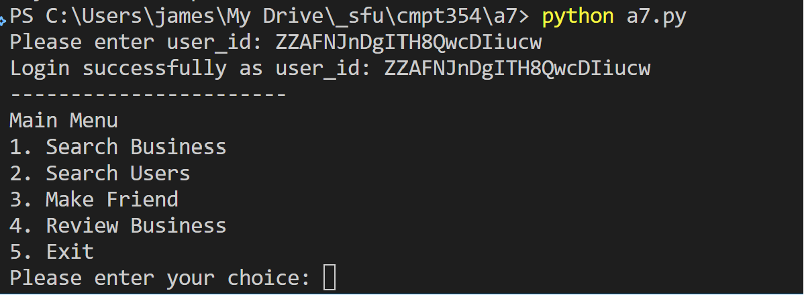

In console run python a7.py, then enter a valid user_id and press ENTER,
the main menu will show:

{width="6.239629265091864in"
height="2.2916830708661418in"}

Choose between 1-5 from the Main Menu then press ENTER

\* When 1 (Search Business) is chosen from Main Menu, enter the
filter(s) and order according to the prompt, leave empty if a filter is
not required, and the records will show. If there are lots of records,
the output will pause periodically so that the terminal is not flushed.
Press Enter to continue showing records or press q and ENTER to return
to Main Menu.

{width="6.5in"
height="2.888888888888889in"}

If no record is found based on the search filters, a message will be
shown:

{width="6.5in"
height="2.582638888888889in"}

\* When choice 2 (Search User) is chosen from Main Menu, choose the
appropriate filter according to prompt and leave empty if a specific
filter is not needed. A list of users will be shown.

{width="6.5in"
height="2.4368055555555554in"}

If no records are found then a message will be shown.

{width="6.5in"
height="2.609722222222222in"}

\* When 3 (Make Friend) is chosen from the Main Menu, enter the user_id
that you want to make friend with:

{width="6.5in"
height="2.0381944444444446in"}

It would prompt if you are already with this user_id as a friend:

{width="6.5in"
height="2.027083333333333in"}

Also it is not allowed to user your own user_id to make friend:

{width="6.5in"
height="1.7645833333333334in"}

\* Choose 4 (Review Business) from the Main Menu, and enter the business
id you want to review and then enter the start 1-5 in integer:

{width="6.5in" height="1.5625in"}

The triggers will automatically update review_count and avg_stars for
the reviewed business

\* Choose 5 (Exit) from the Main Menu to exit from the program

{width="6.5in"
height="1.3847222222222222in"}
